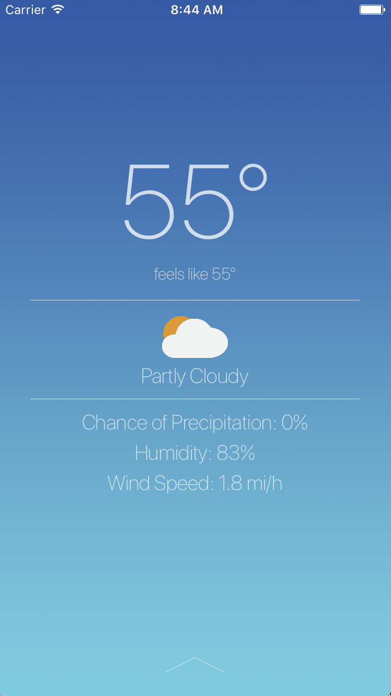

# ChicagoHacksProject

This project got second place at Chicago Hacks 2017. It's a smart weather app that intelligently notifies you what the weather will be like and what clothing you should wear (coat, jacket, shorts, etc.) only for drastic weather changes using an algorithm that takes into account entering specific temperature intervals, precipitation and temperature differences between days. If there are no drastic changes in weather, you will not be notified and can assume that you will wear the same thing as you did before. This app uses Swift and the DarkSky API for sourcing the weather information. Additionally, the app has the ability to source carbon emission information and air quality (using a paid API that is currently not active), as well as notifying the user of ways in which they can reduce their carbon emissions.

